<div align="center">

# 🧠 Stroke Risk Prediction

### Machine Learning Classification & Interactive Prediction Application

**Predicting stroke risk using demographic, lifestyle, and health-related factors**


</div>

---

## 📌 Project Overview

Stroke is a serious health condition whose risk can be associated with demographic, lifestyle, and clinical factors.

This project develops a **machine learning classification system** to identify individuals with a higher likelihood of stroke.

The project covers the complete machine learning workflow:

* Exploratory Data Analysis
* Data preprocessing
* Class imbalance handling using **SMOTE**
* Training and comparison of multiple classification algorithms
* Model evaluation using multiple performance metrics
* Selection of a final machine learning model
* Deployment through an interactive **Streamlit web application**

---

## 🎯 Objectives

The main objectives of this project are:

1. Explore factors associated with stroke.
2. Handle the highly imbalanced target variable.
3. Compare multiple machine learning classification algorithms.
4. Evaluate models beyond Accuracy using Precision, Recall, F1-Score, Specificity, Sensitivity, and AUC.
5. Build an interactive application for stroke-risk prediction.

---

# 📊 Exploratory Data Analysis

## Target Class Distribution

The original dataset is highly imbalanced, with stroke cases representing only a small proportion of observations.

<p align="center">
  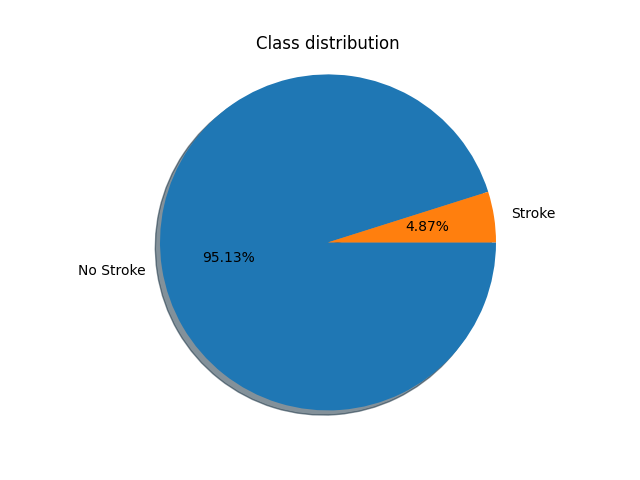
</p>

| Class     | Proportion |
| --------- | ---------: |
| No Stroke |     95.13% |
| Stroke    |      4.87% |

Because of this imbalance, **accuracy alone is not sufficient** for evaluating the classification models.

---

## Feature Distribution

<p align="center">
  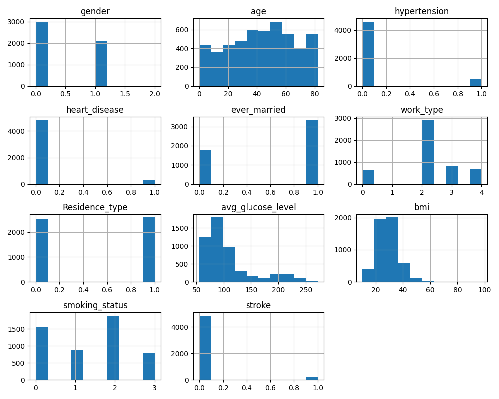
</p>

The dataset contains demographic and health-related variables including:

* Gender
* Age
* Hypertension
* Heart disease
* Marital status
* Work type
* Residence type
* Average glucose level
* BMI
* Smoking status

---

## 🔗 Feature Correlation

<p align="center">
  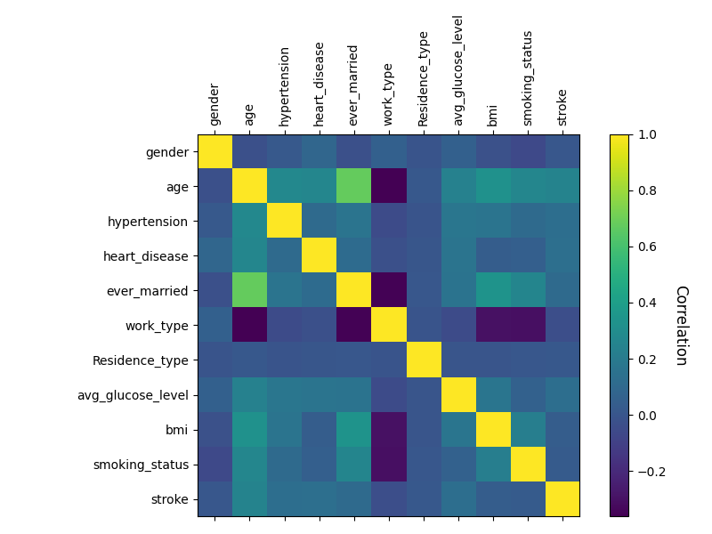
</p>

The correlation matrix provides an overview of relationships among input variables and the target variable.

Among the analyzed factors, variables such as **age, average glucose level, hypertension, and heart disease** show notable relationships with stroke occurrence.

---

# ⚖️ Handling Class Imbalance

The original target variable is strongly imbalanced.

To reduce the model's tendency to favor the majority class, **SMOTE (Synthetic Minority Over-sampling Technique)** was applied to generate synthetic minority-class observations.

### Before SMOTE

<p align="center">
  
</p>

### After SMOTE

<p align="center">
  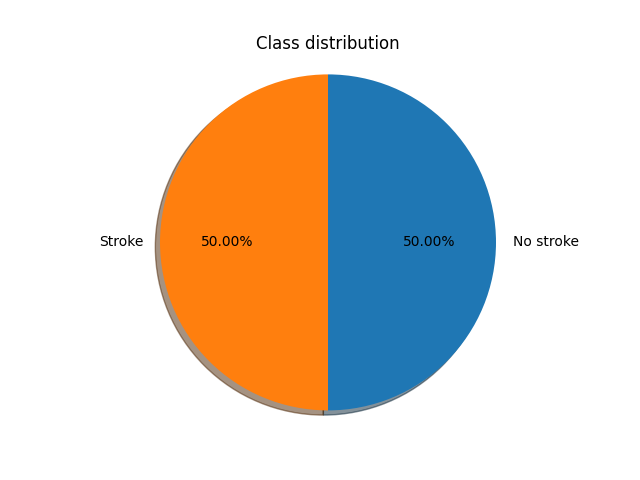
</p>

After resampling:

| Class     | Distribution |
| --------- | -----------: |
| No Stroke |          50% |
| Stroke    |          50% |

---

# 🤖 Machine Learning Models

Seven classification algorithms were evaluated:

| Model                  | Abbreviation |
| ---------------------- | ------------ |
| Support Vector Machine | SVM          |
| Gaussian Naive Bayes   | GNB          |
| Logistic Regression    | LR           |
| Decision Tree          | DT           |
| Random Forest          | RF           |
| LightGBM               | LGBM         |
| XGBoost                | XGB          |

The models were evaluated using several metrics rather than relying only on Accuracy.

---

# 📈 Model Performance

<p align="center">
  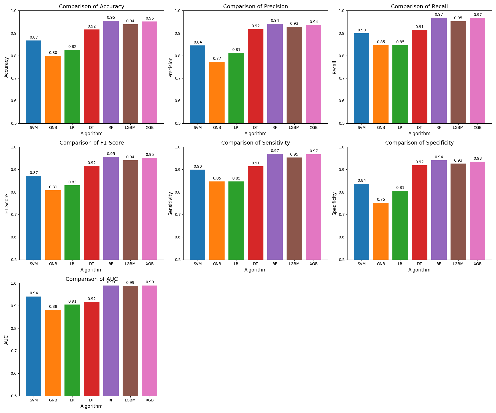
</p>

### Model Comparison

| Model  | Accuracy | Precision |   Recall | F1-Score | Sensitivity | Specificity |      AUC |
| ------ | -------: | --------: | -------: | -------: | ----------: | ----------: | -------: |
| SVM    |     0.87 |      0.84 |     0.90 |     0.87 |        0.90 |        0.84 |     0.94 |
| GNB    |     0.80 |      0.77 |     0.85 |     0.81 |        0.85 |        0.75 |     0.88 |
| LR     |     0.82 |      0.81 |     0.85 |     0.83 |        0.85 |        0.81 |     0.91 |
| DT     |     0.92 |      0.92 |     0.91 |     0.92 |        0.91 |        0.92 |     0.92 |
| **RF** | **0.95** |  **0.94** | **0.97** | **0.95** |    **0.97** |    **0.94** | **0.99** |
| LGBM   |     0.94 |      0.93 |     0.95 |     0.94 |        0.95 |        0.93 | **0.99** |
| XGB    | **0.95** |  **0.94** | **0.97** | **0.95** |    **0.97** |        0.93 | **0.99** |

---

## 🕸 Overall Performance

<p align="center">
  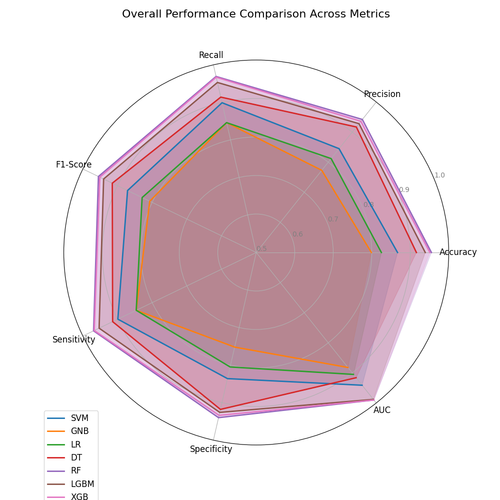
</p>

Tree-based ensemble models — particularly **Random Forest, LightGBM, and XGBoost** — consistently outperform the simpler classifiers across most evaluation metrics.

---

# 🏆 Final Model — Random Forest

**Random Forest** was selected as the final model because it provides strong and balanced classification performance.

### Performance

| Metric      |    Score |
| ----------- | -------: |
| Accuracy    |  **95%** |
| Precision   |  **94%** |
| Recall      |  **97%** |
| F1-Score    |  **95%** |
| Sensitivity |  **97%** |
| Specificity |  **94%** |
| AUC         | **0.99** |

A high **Recall / Sensitivity** is particularly valuable in this problem because failing to identify an individual belonging to the stroke-risk class can be more consequential than generating a false positive.

---

## 📉 ROC Curve — Random Forest

<p align="center">
  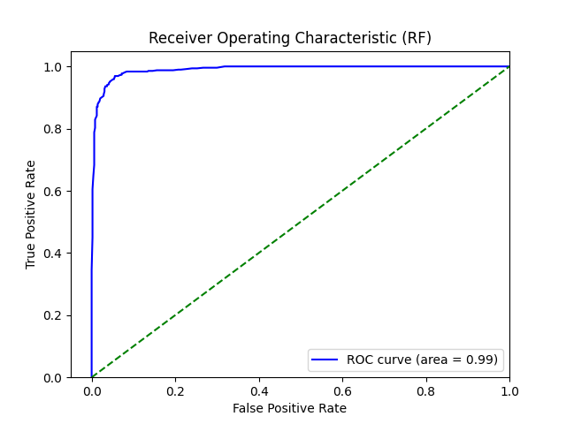
</p>

The Random Forest model achieved an **AUC of 0.99**, indicating strong discrimination between the two classes in the evaluated dataset.

---

<details>
<summary><b>📈 View ROC Curves for Other Models</b></summary>

### Support Vector Machine

<p align="center">
  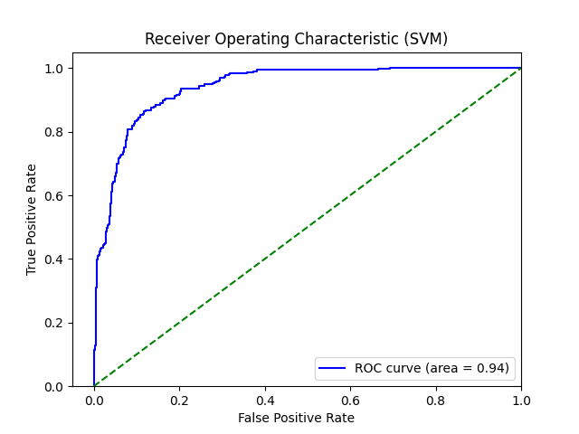
</p>

### Gaussian Naive Bayes

<p align="center">
  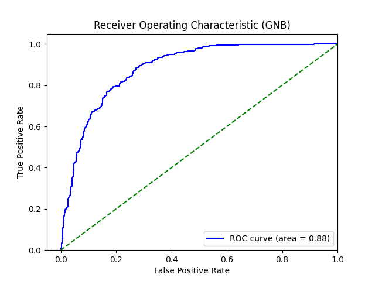
</p>

### Logistic Regression

<p align="center">
  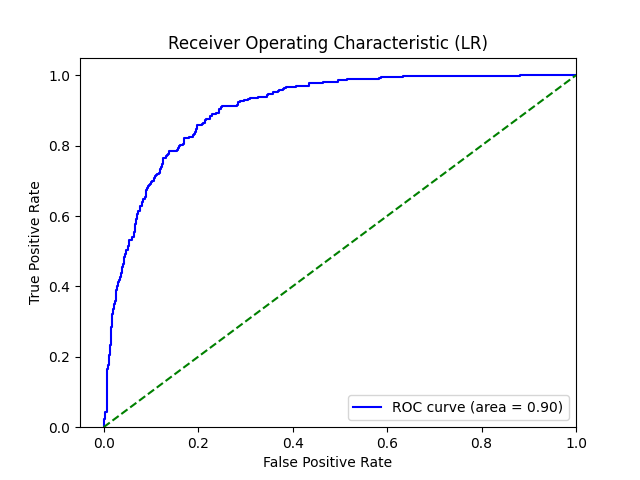
</p>

### Decision Tree

<p align="center">
  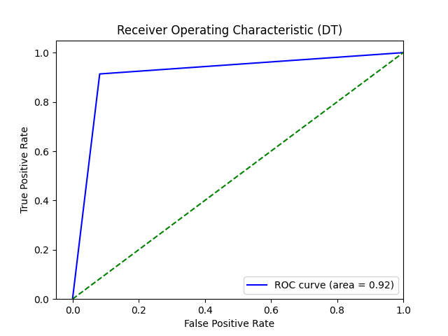
</p>

### LightGBM

<p align="center">
  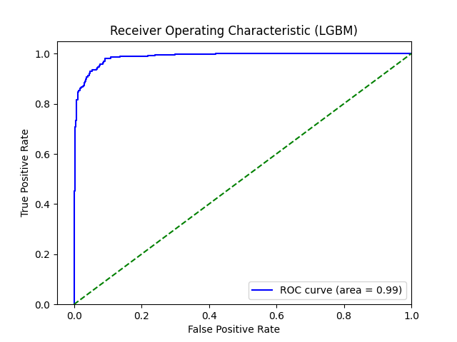
</p>

### XGBoost

<p align="center">
  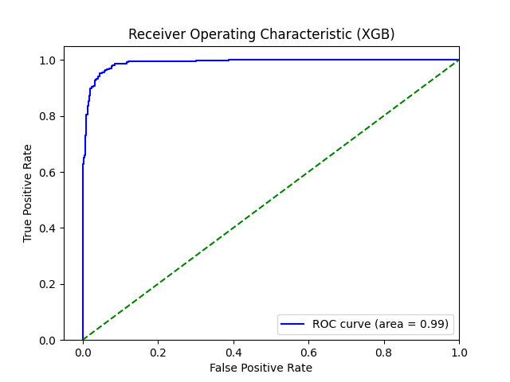
</p>

</details>

---

# 🔄 Machine Learning Workflow

```text
Raw Dataset
     │
     ▼
Data Preprocessing
     │
     ▼
Exploratory Data Analysis
     │
     ▼
Class Imbalance Handling
     │
   SMOTE
     │
     ▼
Train / Validation / Test Split
     │
     ▼
Feature Standardization
     │
     ▼
Model Training
     │
     ├── SVM
     ├── Gaussian Naive Bayes
     ├── Logistic Regression
     ├── Decision Tree
     ├── Random Forest
     ├── LightGBM
     └── XGBoost
     │
     ▼
Model Evaluation
     │
     ▼
Random Forest
     │
     ▼
Streamlit Application
```

---

# 🖥️ Stroke Prediction Web Application

An interactive application was developed using **Streamlit**.

Users can provide health and demographic information such as:

* Age
* Gender
* Hypertension
* Heart disease
* Average glucose level
* BMI
* Smoking status
* Marital status
* Work type
* Residence type

The application processes the information using the same preprocessing pipeline and returns a stroke-risk prediction.

### Example

```text
Age                  → 55
Hypertension         → Yes
Heart Disease        → No
Average Glucose      → 140
BMI                  → 28.5
Smoking Status       → Formerly Smoked

                 ↓

        Random Forest Model

                 ↓

     Stroke Risk Prediction
```

---

# 🛠️ Technology Stack

### Programming & Data

`Python` `Pandas` `NumPy`

### Machine Learning

`Scikit-learn` `SMOTE` `XGBoost` `LightGBM`

### Visualization

`Matplotlib`

### Deployment

`Streamlit`

### Cloud

`AWS S3`

---

# 📁 Project Structure

```text
stroke-prediction/
│
├── README.md
│
├── app.py
├── model_predict.py
├── requirements.txt
│
├── data/
│   └── processed_healthcare_data.csv
│
├── models/
│   ├── random_forest_model.sav
│   └── scaler.sav
│
└── images/
    ├── BAR_CHART.png
    ├── CORRELATION.png
    ├── FEATURE.png
    ├── NO_SMOTE.png
    ├── SMOTE.png
    ├── RADAR_CHART.png
    ├── SVM.png
    ├── GNB.png
    ├── LR.png
    ├── DT.png
    ├── RF.png
    ├── LGBM.png
    └── XGB.png
```

---

# 🚀 Run Locally

### 1. Clone the repository

```bash
git clone https://github.com/YOUR-USERNAME/stroke-prediction.git
cd stroke-prediction
```

### 2. Install dependencies

```bash
pip install -r requirements.txt
```

### 3. Run the application

```bash
streamlit run app.py
```

---

# 💡 Key Findings

* The original dataset exhibits **severe class imbalance**, with stroke observations accounting for only approximately 4.87% of the data.
* SMOTE was used to improve representation of the minority class during model development.
* Ensemble tree-based algorithms achieved the strongest overall results.
* Random Forest and XGBoost both reached approximately **95% Accuracy** and **97% Recall**.
* Random Forest achieved an **AUC of 0.99** and was selected as the final deployed model.
* Evaluating Recall, Specificity, F1-Score, and AUC provides a more informative assessment than using Accuracy alone for an imbalanced medical classification problem.

---

# 🔮 Future Improvements

Potential extensions of the project include:

* Hyperparameter optimization using GridSearchCV or RandomizedSearchCV
* Cross-validation
* Feature importance analysis
* SHAP-based model explainability
* Probability calibration
* Improved user interface for the Streamlit application
* Cloud deployment
* Testing with external datasets to evaluate model generalization

---

## ⚠️ Disclaimer

This project was developed for **educational and data science purposes**.

The prediction generated by the model should **not be interpreted as a medical diagnosis or professional medical advice**.

---

<div align="center">

### 👩‍💻 Developed as a Machine Learning & Data Analytics Project

⭐ If you find this project useful, feel free to star the repository.

</div>
